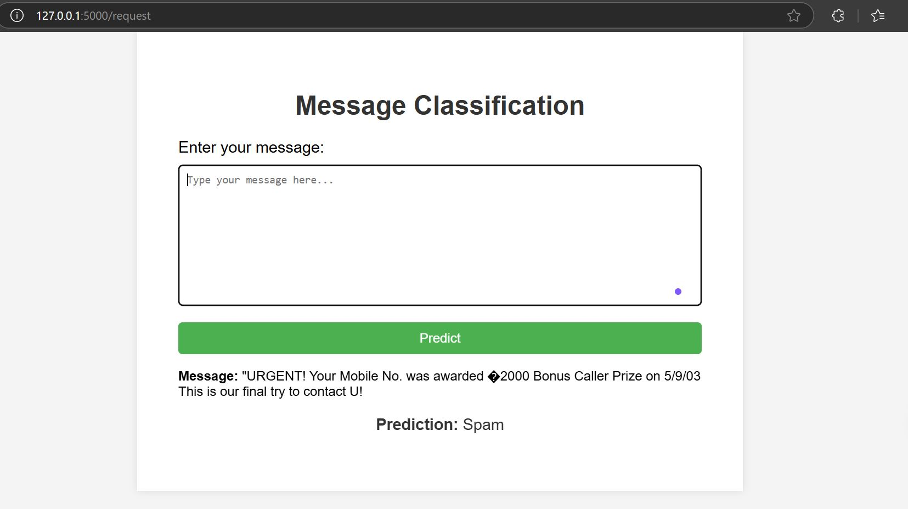
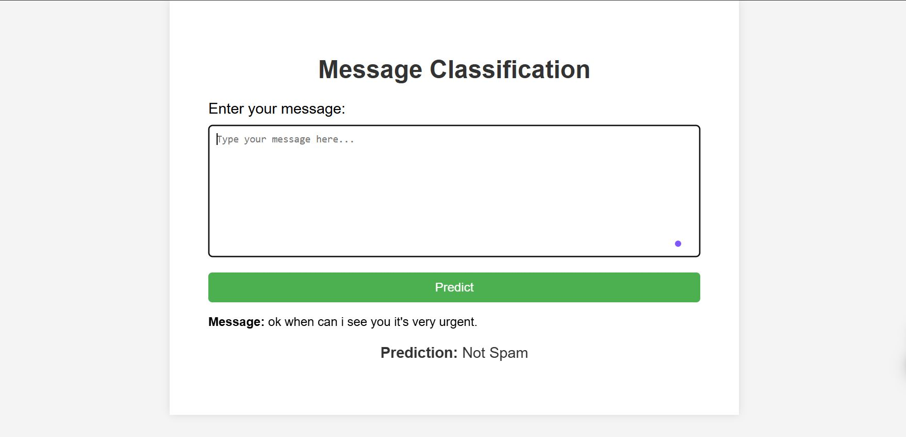

# Spam Classification Web App

A Flask-based web application for classifying text messages as **Spam** or **Not Spam**. This project uses a pre-trained machine learning model to predict whether a message is spam based on its content.

## Features

- User-friendly web interface for submitting messages.
- Predicts whether a message is spam or not.
- Displays probabilities of classification.
- Handles common HTTP errors (404, 500, 403) gracefully.

## Prerequisites

Before running the application, ensure you have the following installed:

- Python 3.x
- Flask
- Necessary Python packages (listed in `requirements.txt` or specified later)


## How It Works

The web application processes user-submitted text messages to determine whether they are **Spam** or **Not Spam**. Here's a breakdown of how the app works:

1. **User Input**: The user submits a text message via the web interface.
2. **Vectorization**: The input message is converted into a numerical format using the `text_to_vector` function.
3. **Prediction**: A pre-trained machine learning model predicts the probability of the message being spam.
   - If the spam probability is above a certain threshold (e.g., 10%), the message is classified as "Spam".
   - Otherwise, it is classified as "Not Spam".
4. **Results Display**: The classification result and the original message are displayed on the web page.





## Getting Started

1. **Clone the repository**:
   ```bash
   git clone https://github.com/Mrsenjiii/Email-Spam-Classifier.git
   cd spam-classifier


## Error Handling

The application is designed to handle common HTTP errors gracefully:

- **404 - Page Not Found**: Triggered when a user navigates to a non-existent route.
- **500 - Internal Server Error**: Triggered for unexpected server-side errors.
- **403 - Forbidden**: Triggered for restricted access.

---

Next phases will include details about the machine learning model, deployment, and contributing. Let me know when to proceed!


## Machine Learning Model

The core of this application is a pre-trained machine learning model stored as `modelvclf.pkl`. Here's a brief overview of how the model was built and its functionality:

### Model Overview

- **Algorithm**: The model is a probabilistic classifier that outputs the likelihood of a message being spam.
- **Training Data**: The model was trained on a labeled dataset of text messages containing spam and non-spam examples.
- **Feature Engineering**: Text messages are vectorized into numerical format using the `text_to_vector` function, enabling the model to process and analyze the input.

### How Predictions Work

1. **Input Text**: A user provides a text message through the web interface.
2. **Vectorization**: The `text_to_vector` function transforms the text into a numerical representation suitable for the model.
3. **Prediction**:
   - **`predict_proba()`**: Outputs the probability of the message being spam.
   - If the spam probability exceeds 0.1 (10%), the message is classified as "Spam".
   - Otherwise, it is classified as "Not Spam".

---

### Threshold Selection

The threshold for spam classification can be adjusted based on user needs. Currently, the threshold is set to **10% (0.1)** for demonstration purposes. This value determines the sensitivity of the spam detection.

---

In the next phase, we’ll include deployment instructions, contribution guidelines, and future work. Let me know when you're ready to proceed!


## Contributing

Contributions are welcome! If you'd like to improve the project or add new features, follow these steps:

1. **Fork the Repository**:
   Click on the "Fork" button at the top of this repository to create your copy.

2. **Clone Your Fork**:
   Clone your forked repository to your local machine:
   ```bash
   git clone https://github.com/<mrsenjiii>/<Email-Spam-Classifier.git
